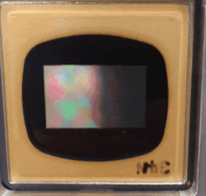

# DMD_Pycrafter9000
[](https://zenodo.org/badge/latestdoi/459919255)  
I created a module to control the Lightcrafter9000 EVM (Texas Instruments) because there were only modules available for the Lightcrafter6500.
So, I integated and modified the previous code and developed several features. The main features are listed below.  

+ `Module for Lightcrafter9000`
    + As mentioned above, modules to control Lightcrafter9000 is developed 
+ `Basic pattern generation`  
    + circle, line, number and Hadamard pattern generator were added
+ `Sequence order setting`
    + Due to limited memory, it is important to avoid storing duplicate images on the device.
    + To address this issue, I implemented a function that sets the sequence for displaying images on the device.

# Test Environment
1. Conda environment
    + Please refer the [conda environment file](./env.yml)
    
2. Hardware   
```
CPU : AMD Ryzen 9 5900X  
GPU : NVIDIA GeForceRTX 3080Ti  
memory : 64 GB  
OS : windows11  
Virtual env : Conda
TTL generator : Master9 
```

# Note
1. Device connection
    + This module only support USB communication
    + For USB communication, python the [`hidapi`](https://pypi.org/project/hidapi/) package should be installed
2. Input data type
    + input image data type is `bool`

# Demonstration
Please refer the [example](./hadamard.ipynb)

1. Ascending order number  
    + displaying `0-9` in ascending order with `duration 0.3 s`
    + interimage delay `0.3 s`


2. Specifying order and duration (The way for saving memory)
    + Stored number `0-13`
    + number sequence `[0, 5, 13, 13, 13, 1, 7, 6]` (only displaying `0, 1, 5, 6, 7, 13` from the stored number `0-13` on the device) 
    + duration order `[0.4, 0.2, 1, 0.6, 0.2, 0.3, 0.3, 0.1]` in `sec`
    + interimage delay `0.4 s`



3. Hadamard pattern
    + 11 images
    + no interimage delay


# Reference
[1] https://github.com/csi-dcsc/Pycrafter6500  
[2] https://github.com/QI2lab/mcSIM  
[3] https://github.com/micropolimi/DMD_ScopeFoundry 
[4] https://github.com/adamcohenlab/Hadamard-Code    
[5] [Programmer's guide](https://www.ti.com/lit/ug/dlpu018h/dlpu018h.pdf?ts=1675332908303)  
